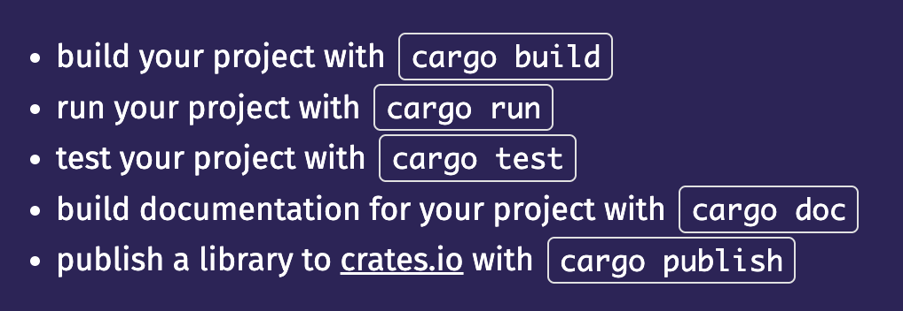

## Pour déployer sur le serveur:

- Il faut d'abord créer l'image docker à partir du fichier Dockerfile

    * Utiliser la commande :
    ```bash
    docker build -t registry.nocturlab.fr/mtranchant/brief21phoque .
    ```

- Puis il faut envoyer cette image sur le serveur

    * Utiliser la commande :
    ```bash
    docker push registry.nocturlab.fr/mtranchant/brief21phoque
    ```

L'image est maintenant disponible dans le serveur.

- Copier l'entièreté du fichier compose.yml

- Se connecter au serveur avec ses identifiants

- Créer un nouveau fichier compose.yml et coller

    * Utiliser la commande :
      ```bash
      docker compose up
      ```
      
- Se rendre dans son navigateur et mettre l'url défini dans le compose.yml sur la ligne du traefik host : 
  ```bash
  brief21bichette.nocturlab.fr
  ```
  
## Pour lancer le projet en local

- Installer rust et rustup(s'il n'est pas installé)
  - sur mac :
    ```markdown
    brew install rust
    brew install rustup
    ```
    

  

Le projet ne se lancera pas car il y a la configuration de la version nightly de Rust dans le projet. Et malgré cette commande pour passer à la version nightly, mon mac ne le fait pas :
```bash
rustup default nightly && rustup update
```

Après ce problème de réglé, le projet ne démarre pas car il faut configurer la base de données dans postgres pour que le projet se lance.

## Sources

- [Doc docker](https://hub.docker.com/_/rust)

- [Example de projet github](https://github.com/docker/awesome-compose/blob/master/react-rust-postgres)

- [Doc Rust](https://doc.rust-lang.org/book/)

- [Example Rust with Postgres](https://tms-dev-blog.com/postgresql-database-with-rust-how-to/)

- [Cargo](https://www.rust-lang.org/learn/get-started)